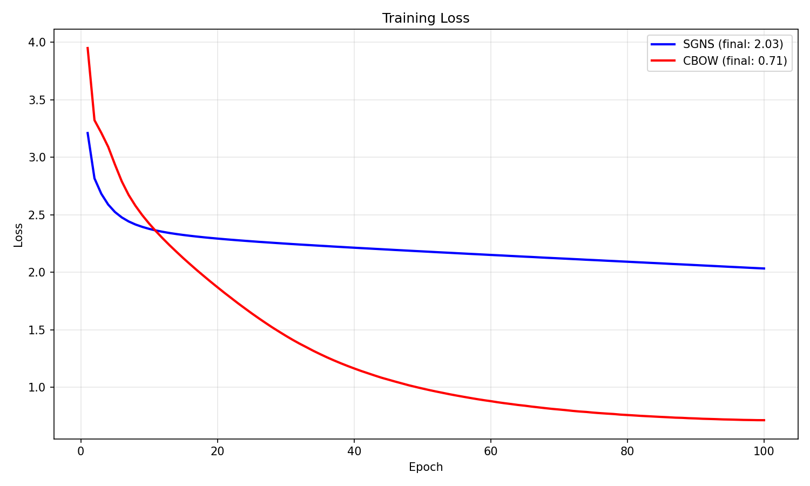
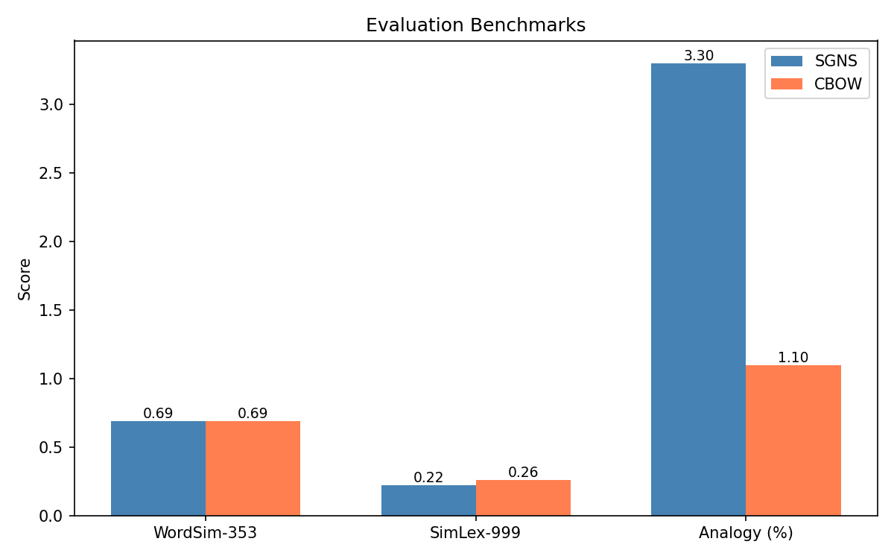
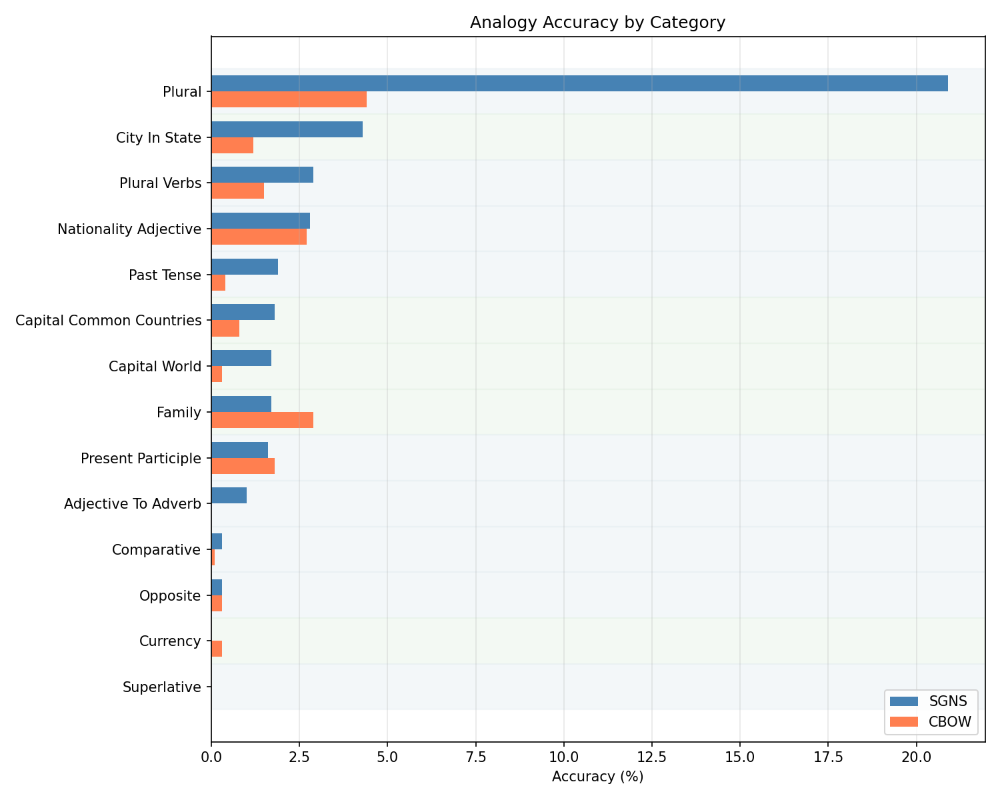
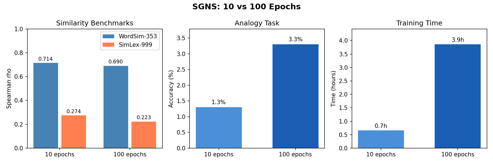

# Word2Vec

A implementation of Word2Vec (Skip-gram and CBOW) [1] in pure NumPy **that is fast**

## Table of Contents

- [Dataset](#dataset)
- [Implemented Methodds](#implemented-methods)
- [Usage](#usage)
- [Results](#results)
- [Future Work](#future-work)
- [References](#references)


## Dataset

### Text8 Dataset

**Source**: http://mattmahoney.net/dc/text8.zip

Text8 is a standard dataset derived from the first 100MB of cleaned Wikipedia text (Mahoney, 2006) [2]. It was used in the original word2vec experiments [1], but in the original paper it's 1B tokens, here I only use the 19M tokens version.

| Property | Value |
|----------|-------|
| Tokens | 19M (19429295) |
| Vocabulary | 60,000 |
| Size | 95.4 MB |
| Content | English Wikipedia |

### Evaluation Datasets

#### WordSim-353: Word relatedness [3]
- 353 word pairs with human similarity ratings (0-10 scale)
- Measures semantic relatedness (similarity + association)
- Classic benchmark

#### SimLex-999: Word similarity [4]
- 999 word pairs rated for genuine similarity
- Distinguishes similarity from association ("coffee" and "cup" are related but not similar)
- More challenging and linguistically principled

#### Google Analogies: Word analogy accuracy [1]
- 19,544 analogy questions across 14 categories
- 5 semantic categories (capital-country, currency, etc.)
- 9 syntactic categories (verb tenses, plurals, etc.)

## Implemented Methods

+ Skip-gram with Negative Sampling (SGNS)
+ Continuous Bag of Words (CBOW) with Negative Sampling
+ JIT-compiled forward/backward and gradient update
+ Subsampling
+ Linear decay
+ Cache negative sampling

## Usage

### Install requirements

```bash
# Install with uv
uv sync

# Or with pip
pip install -e .
```

### Train

```bash
# CBOW
uv run train_cbow.py

#SGNS
uv run train_sgns.py
```

### Train and Evaluate

```bash
uv run python evaluate.py --model cbow --epochs 3

# Full training
uv run python evaluate.py --model sgns --epochs 100 --dim 300 --neg 10 --lr 0.025 --tokens 19000000

# To show all available flags
uv run python evaluate.py --help
```

**Success metrics**
1. **Word Relatedness**: Spearman rho > 0.5 (WordSim-353)
2. **Word Similarity**: Spearman rho > 0.3 (SimLex-999)
3. **Word Analogy**: Accuracy > 40% total (Text8 baseline)
    + Accuracy > 50% on semantic
    + Accuracy > 35% on syntactic

## Results

Training logs in `results/` folder. Benchmarks on Text8 (19M tokens). Those are trained on more epochs as dataset is smaller than the original 1B tokens dataset used in the paper.

### SGNS vs CBOW (100 epochs)

<p align="center">
  
  
</p>

<p align="center">
  
</p>

| Model | WordSim-353 | SimLex-999 | Analogy | Time |
|-|-|-|-|-|
| SGNS | 0.690 | 0.223 | **3.3%** | 13888.9s (3.86h) |
| CBOW | 0.688 | **0.260** | 1.1% | 2309.4s (0.64h) |

SGNS outperforms CBOW on analogy (3x better), while CBOW is better on SimLex-999. CBOW loss converges to 0.71 vs SGNS's 2.03 (but lower loss doesn't mean better embeddings so this doesn't say much). One important thing to note is SGNS takes 6 times longer to train compared to CBOW.

### SGNS: 10 vs 100 Epochs

<p align="center">
  
</p>

| Epochs | WordSim-353 | SimLex-999 | Analogy | Time |
|-|-|-|-|-|
| 10  | **0.714** | **0.274** | 1.3% | 0.65h |
| 100 | 0.690 | 0.223 | **3.3%**| 3.86h |

More epochs improve analogy but hurt similarity metrics slightly, so maybe the model is overfitting to some patterns.

## Future Work
*Note*: Some ideas are similar as my thought on future work is generalisation and specialization for specific use cases/settings.
1. Add new words without full retraining (Vocab expansion - "Online Learning of Word Embeddings" (Kaji & Kobayashi 2017))
2. Finetune on specific domain data (Domain adaptation - "Learning Domain-Specific Word Embeddings from Sparse Data" (Xu et al. 2018))
3. (Multi-Domain) Continual Learning. Whether catastrophic forgetting or not.
4. Transfer Learning - Domain adaptation experiments with secondary datasets.
5. Fix seeding mechanism (create rng and ensure it works with jit). Make seeding an arguments.


## References

[1] Mikolov, T., Chen, K., Corrado, G., & Dean, J. (2013). Efficient Estimation of Word Representations in Vector Space. 1st International Conference on Learning Representations (ICLR). https://arxiv.org/abs/1301.3781

[2] Mahoney, M. (2006). About the Test Data / Rationale for a Large Text Compression Benchmark. *http://mattmahoney.net/dc/textdata.html*.

[3] Finkelstein, L., Gabrilovich, E., Matias, Y., Rivlin, E., Solan, Z., Wolfman, G., & Ruppin, E. (2002). Placing Search in Context: The Concept Revisited. ACM Transactions on Information Systems, 20(1), 116-131.

[4] Hill, F., Reichart, R., & Korhonen, A. (2015). SimLex-999: Evaluating Semantic Models With (Genuine) Similarity Estimation. Computational Linguistics, 41(4), 665-695.

[5] Mikolov, T., Sutskever, I., Chen, K., Corrado, G. S., & Dean, J. (2013). Distributed representations of words and phrases and their compositionality. Advances in Neural Information Processing Systems, 26. https://arxiv.org/abs/1310.4546
